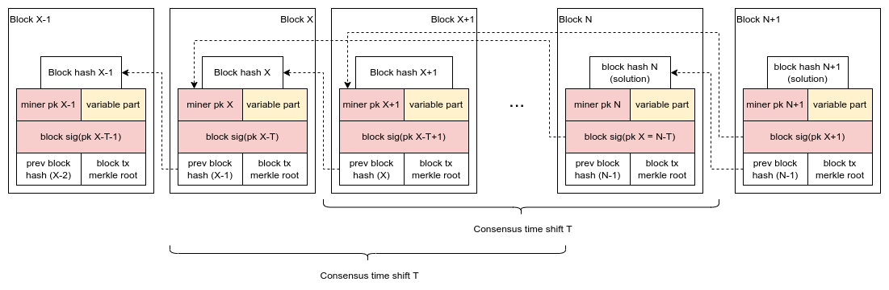
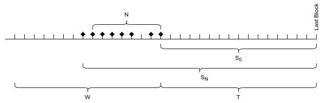

# Time Shift Proof-of-Work Beyond a Functional Spec

Disclaimer: This write-up was created due to a private discussion between several people. Authorship of this idea belongs to a broader group of people than just the committers here. Original idea by Jack Liao.

## Intro

There are several known ways to attack Proof-of-Work (PoW) blockchain consensus mechanism. All of them assume having access to a majority of hash power for a period of time T~A~.  Making these attacks harder could involve, for example, increasing T~A~ necessary for a successful attack. Time Shift Proof-of-Work (TSPoW) is an effort in that direction.  Among other things, a successful attack on TSPoW requires maintaining the majority of hash power during two precise time windows.

In bitcoin proof of work, two operations - 1) creating a new block and 2) finding a solution to a block, are closely tied together.  Time Shift Proof-of-Work (TSPOW) separates them in time.  That is why rewriting the history of the blockchain sequence becomes even harder than in the Nakamoto consensus.

## Spec

### Time Shift

According to the TSPoW consensus rules, miners who compete to find a block solution hash do not create block candidates.  Instead, they obtain signed block templates from a pool of block creators.  Miners solve these blocks, constructed based on the received block template. When the winner adds a new block to the blockchain,  he adds his public key to the mined block, which serves as proof of his right to become a new block template creator.  He will be allowed to create a new block template, which will be signed by a signature validated by the public key from the block he mined.  Block template creation is limited by a time window between $T$ and $T+W$ blocks from the block he mined and by the number of blocks he can create (one by default)[^1].   $T$ and $W$ are controlled by the consensus.  While in a time period between  $T$ and $T+W$ and until he produces a block template[^2], the miner is considered a member of the pool of block creators.  A newly created block template contains his mining reward: a coinbase transaction spendable by the block template creator.  Thus, the mining reward is also delayed and separated from finding a hash: when winning a solution for the new block, a miner does not receive any reward. 

A block should contain the following new metadata:

* A public key of a miner who solved it.
* A signature of the block template creator, verifiable by the public key from an earlier block.
* A variable part for a miner to look for the block solution. (MS: isn't that what the payload is for?)
* Blocks may also contain additional fields needed for optimization, like a reference to the block that contains the miner's public key.

Note: a public key/signature used for block template creation authorization may be replaced by a hash/preimage pair which is much more performance efficient.

TSPOW makes many types of attacks on the Nakamoto PoW consensus more expensive.

MS: нарисуй в терминологии T, W

### Mining Difficulty Adjustment

TSPoW must balance a benign case when а block creator does not show up to provide a new block template when expected.  The same effect may result from a more malicious situation when miners favor some block templates and ignore others.

TSPoW can protect itself from such imbalance if it assumes an additional rule to adjust the current block mining difficulty:

$d = D \cdot \frac {\sum S_i} {(T+N/2) \cdot N}$, where

$d$ - current block difficulty.

$D$ - base block difficulty, calculated in a regular way.

$T_1$ - the mining time shift. After $T_1$ blocks a miner gets his right to make a new block template.

$W$ - the number of blocks when a block creator can use hit right to create a new block template.

$N$ - a "normal" size of the block creators pool. It may be equal to the size of the time-shift mining window $W$ if the mining scheme allows it. 

$S_i$ - the distance in blocks between an available block template and the current blockchain height.

 

These current block difficulty adjustments create an economic incentive for the miners to pick the oldest block template for their new block.
Otherwise, the difficulty will increase, increasing the search time for a block solution, provided the hash power stays the same.
This will either: 

* Balance out the disappearance of a miner from the pool of block creators: until the "hole" is eliminated, the mining will be slower;
* Decrease miners' reward per time period in case they favor some block templates.

[^1]: Implement Jack's idea of creating more than one block is not as easy as it seems- to be invented.
[^2]: We are worried that since the time window and the public key of the block creator are known, it can potentially be used for an equivalent of a grinding attack.  To be analyzed further.
