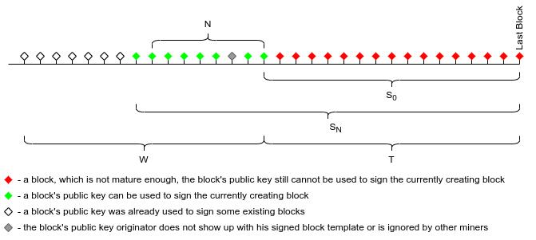

# Time Shift Proof-of-Work Beyond a Functional Spec

Disclaimer: This write-up was created due to a private discussion between several people. Authorship of this idea belongs to a broader group of people than just the committers here. Original idea by Jack Liao.

## Intro

The well-known Proof-of-Work (PoW) blockchain consensus mechanism is vulnerable to several well-known attacks. One of the most known is the 51% attack.
While this does not mainly affect the largest blockchain projects like Bitcoin, it is not true for minor blockchain projects or just boot-strapping blockchains.
Additional mechanisms to classical PoW should allow increasing resistance to the most well-known attacks on blockchain consensus.

## Common

In bitcoin proof of work, two operations - 1) creating a new block and 2) finding a solution to a block, are closely tied together.  The main idea of Time Shift Proof-of-Work (TSPOW) is to separate them in time.  As a result, rewriting the history of the blockchain sequence becomes even harder than in the Nakamoto consensus.

## Spec

### Time Shift

According to the TSPOW consensus rules, miners who compete to find a block solution hash do not create block candidates.  Instead, they communicate with a pool of block creators and obtain signed block templates from the block creators.  Miners solve these blocks, constructed based on the received block template. When the winner adds a new block to the blockchain,  he adds his public key to the mined block, which serves as proof of his right to become a new block template creator.  He will be allowed to create a new block template, which will be signed by a signature validated by the public key from the block he mined.  Block template creation is limited by a time window between T and T+W blocks from the block he mined.   T and W are controlled by the consensus.  While in a time period between  T and T+W, the miner is considered a member of the pool of block creators.  A newly created block template contains the mining reward: a coinbase transaction spendable by the block template creator.  Thus, the mining reward is also delayed and separated from the process of finding a hash. 
At the time of winning a solution for the new block, a miner does not receive any reward. 

A block should contain the following new metadata:

* A public key of a miner who solved it.
* A signature of the block template creator, verifiable by the public key from an earlier block.
* A variable part for a miner to look for the block solution. (MS: isn't that what the payload is for?)
* Blocks may also contain additional fields needed for optimization, like a reference to the block that contains the miner's public key.

Note: a public key/signature used for block template creation authorization may be replaced by a hash/preimage pair which is much more performance efficient.

TSPOW makes many types of attacks on the Nakamoto PoW consensus more expensive.

### Mining Difficulty Adjustment

What а miner who won a block solution will not provide a new block template at the time when expected? 
The same effect may happen if miners favor some block templates and ignore others.

TSPoW can protect itself from such imbalance if it assumes an additional rule to adjust the current block mining difficulty:

$d = D \cdot \frac {\sum S_i} {(T+N/2) \cdot N}$, where

$d$ - current block difficulty.

$D$ - some base block difficulty (calculated as usual[MS:Meaning?]).

$T_1$ - the mining time shift. After $T_1$ blocks a miner gets his right to make a new block template.

$W$ - the number of blocks when a block creator can use hit right to create a new block template.

$N$ - a "normal" size of the block creators pool. It may be equal to the size of the time-shift mining window $W$ if the mining scheme allows it. 

$S_i$ - the distance in blocks between an available block template and the current blockchain height. 

These current block difficulty adjustments create an economic incentive for the miners to pick the oldest block template for their new block.
Otherwise, the difficulty will increase, increasing the search time for a block solution, provided the hash power stays the same.
This will either: 

* Balance out the disappearance of a miner from the pool of block creators: until the "hole" is eliminated, the mining will be slower;
* Decrease miners' reward per time period in case they favor some block templates.
