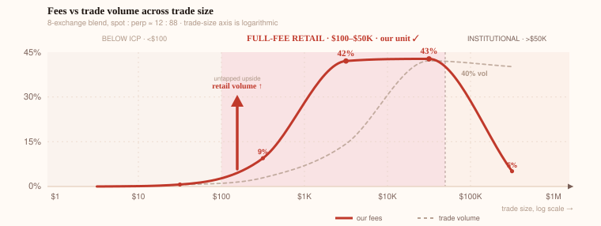

# Why Most Crypto Traders Still Trade by Hand

> **Date:** August 2026
> **Based on:** [Exchange Liquidity & Market Microstructure Research — BTCUSDT](exchange-liquidity-research.md) (own measurements via public exchange APIs, Binance / Bybit / OKX)

If you record every trade that happens on a big crypto exchange and sort them by size, the sizes alone tell you a surprising amount about the *people* behind them. That is what we did — and the shape of the result leads to a simple, slightly unexpected conclusion: **most retail traders still trade manually, with their whole deposit, in a visual UI.**

Here is the picture, taken from our investor deck and built on the measurements:

The dashed line shows where the traded money actually is, across trade sizes from $1 to $1M (the axis is logarithmic — each step is 10×). The solid line is the modeled fee revenue of a retail-focused platform across the same sizes. Three things stand out.

## 1. Small trades are many — big trades carry the money

On spot BTCUSDT, trades under $100 make up roughly two-thirds of all trades, but only about 1.5% of the money. At the other end, trades of $10k–$50k are under 2% of all trades — yet they carry a third of the turnover. This is a classic Pareto (power-law) shape, the same one that describes how wealth itself is distributed. That's also why we trust the shape: it isn't an accident of one measurement window. It comes from how much money the participants have, and that doesn't change overnight.

## 2. The bulge sits exactly at "whole deposit" size

Typical retail deposits are around $1k–$5k. On spot, the volume bulge sits at $1k–$5k tickets. On perpetual futures, where retail commonly uses 10–20× leverage, the bulge moves to $10k–$100k — which is exactly $1k–$5k **multiplied by the leverage**.

In other words: the trades we see are the size of *entire deposits*. People are not trading small slices of their account. They put the whole thing into one order, in one click.

## 3. Exchanges price this in

The fee schedules follow the same picture. Small and mid-size traders sit at the base tier and pay full fees. Really large players get steep VIP discounts — exchanges give margin away to keep the mobile, professional flow from leaving. That is why the solid fee line collapses on the right side of the chart even though the volume there stays high: the whales trade a lot, but pay almost nothing per dollar.

## What this adds up to

Any decent trading algorithm — even a basic one — splits a large order into many smaller pieces. It does this for boring, universal reasons: less price impact, staged entries, hidden intentions, controlled risk. Splitting is the *first* thing automation does.

But the data shows the opposite: retail-sized volume arrives as single, whole-deposit orders. There is no trace of systematic splitting at that scale. Which means there is no automation layer between those traders and the order book.

So the chain is short:

whole-deposit orders → no splitting → no trading bots → **manual trading in a visual interface**.

To be clear, this is not a mathematical proof — it is a fact-supported reading of the data. Some of the mid-size trades are certainly large players slicing their orders, and at retail sizes splitting is also simply less necessary (a $30k order is invisible on a liquid pair). But every signature in the data points the same way, and it matches what everyone in the industry quietly knows: below the institutional tier, algorithmic trading is rare, and the exchange app with a buy button is still the main instrument.

That is the gap the [Open Trader](https://github.com/l2xl/open-trader) project is built for: millions of traders whose position size is already bounded by their deposit — and whose only remaining lever is automating their attention.
